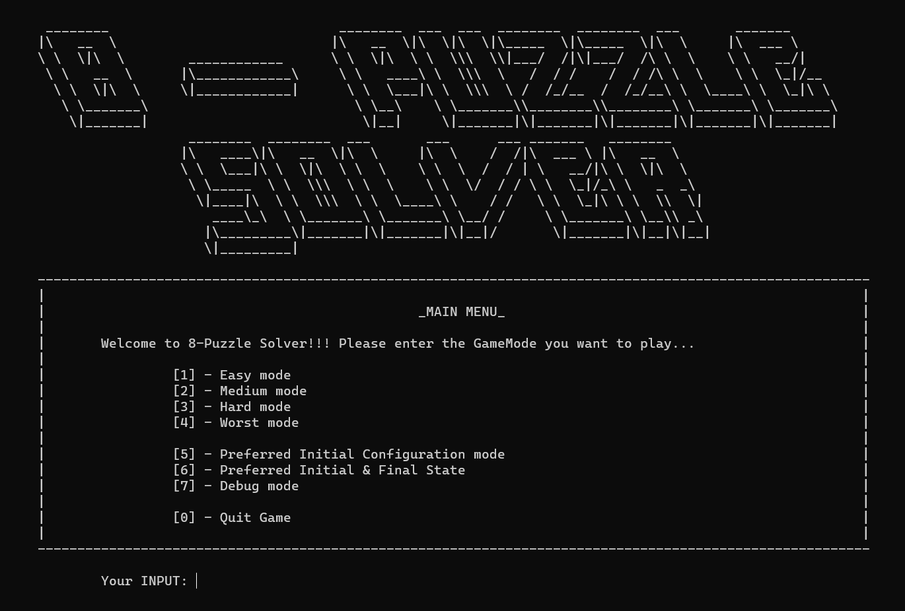
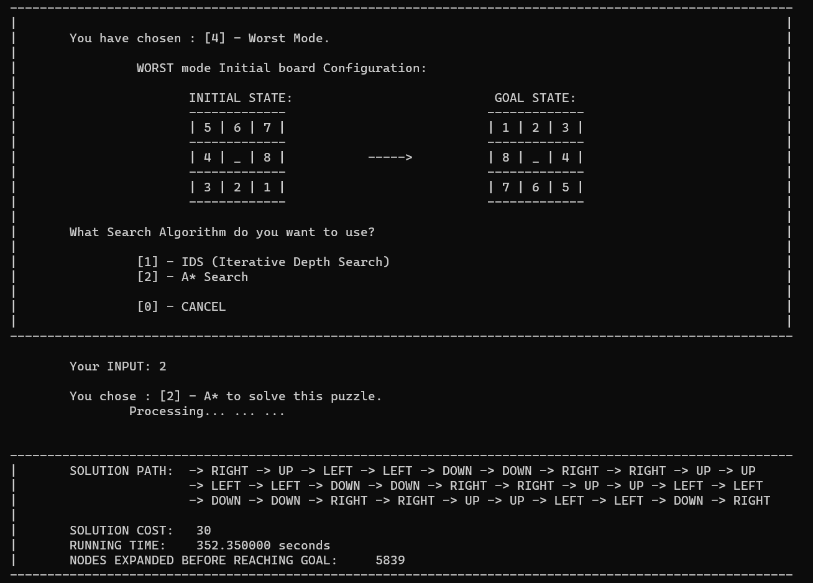
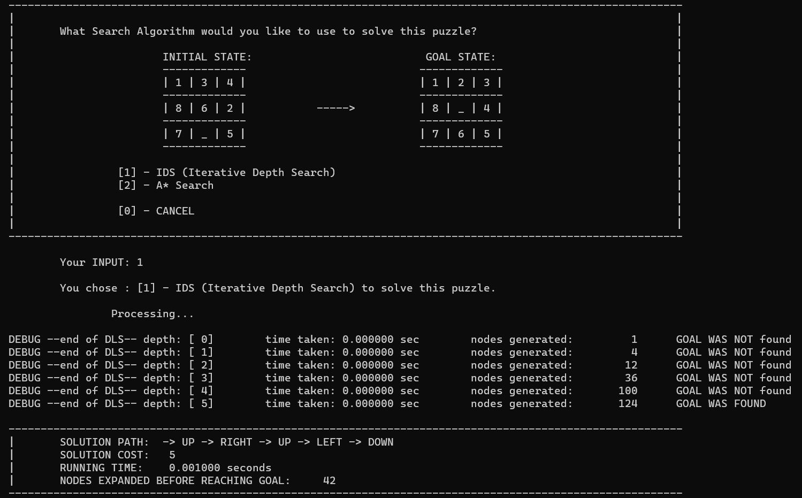

# 8-Puzzle-Solver
This program asks the user to input unique numbers from 0-8 in a 3x3 grid, that will serve as the input for the 8- puzzle. The program will then utilize IDS and A* search to find the solution, solution path, solution cost, number of nodes expanded, and the running time.

    

Default Goal State:&nbsp;&nbsp;&nbsp;&nbsp; Easy mode:&nbsp;&nbsp;&nbsp;&nbsp; Medium mode:&nbsp;&nbsp;&nbsp;&nbsp; Hard mode:&nbsp;&nbsp;&nbsp;&nbsp; Worst mode:

&emsp; 1 2 3 &emsp;&emsp;&emsp;&emsp;&emsp;&emsp; 1 3 4 &emsp;&emsp;&emsp;&emsp; 2 8 1 &emsp;&emsp;&emsp;&emsp;&emsp;&emsp; 2 8 1 &emsp;&emsp;&emsp;&emsp; 5 6 7  
&emsp; 8 _ 4 &emsp;&emsp;&emsp;&emsp;&emsp;&emsp; 8 6 2 &emsp;&emsp;&emsp;&emsp; _ 4 3 &emsp;&emsp;&emsp;&emsp;&emsp;&emsp; 4 6 3 &emsp;&emsp;&emsp;&emsp; 4 _ 8  
&emsp; 7 6 5 &emsp;&emsp;&emsp;&emsp;&emsp;&emsp; 7 _ 5 &emsp;&emsp;&emsp;&emsp; 7 6 5 &emsp;&emsp;&emsp;&emsp;&emsp;&emsp; 7 5 _ &emsp;&emsp;&emsp;&emsp; 3 2 1  

<table>
<tr><th>Default Goal State </th><th>Easy mode</th></tr>
<tr><td>

|  |  |  |
|:--:|:--:|:--:|
| 1 | 2 | 3 |
| 8 | `_` | 4 |
| 7 | 6 | 5 |

</td><td>

|  |  |  |
|:--:|:--:|:--:|
| 1 | 3 | 4 |
| 8 | 6 | 2 |
| 7 | `_` | 5 |

</td></tr> </table>

 
Aside from the pre-set starting configuration of the puzzle, the user can also give their desired starting config. 
Similarly, the user can also provide their own desired goal state to try to reach. 
The program will promptly give a warning if the goal state is impossible to reach, from the starting position. 

 
Algorithms used:

- Iterative Deepening Search(IDS) 
A graph traversal and path search algorithm, which is used in many fields of computer science due to its completeness, optimality, and optimal efficiency. One major practical drawback is its O(b^d) space complexity, as it stores all generated nodes in memory.

- A* Search Algorithm 
IDS (or IDDFS) is a state space/graph search strategy in which a depth-limited version of depth-first search is run repeatedly with increasing depth limits until the goal is found.

Using IDS on problems that require more than 16 steps is will take an unreasonable long time because there is no optimization to prune repeated states in the search tree.
*The algorithms in this program could be further optimized to remember, then ignore repeated states (pruning).*

# MEMBERS

- BALANA, Renmar
- BORRERO, Jan Lance
- SABAS, Jessa Lorenza

*BSCS 3-C (2021-2022)*
